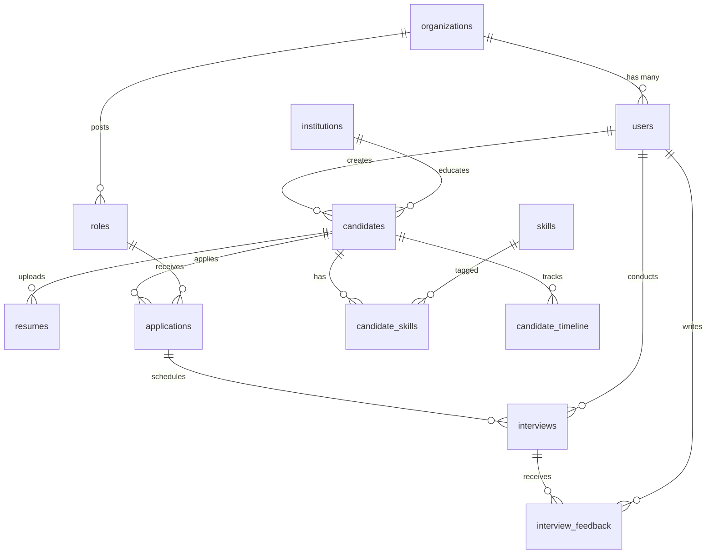

# Milestone 1 — Project Planning, Architecture & Roadmap

## What This Milestone Covers

This is the **foundation document** for HireLoop AI. No code runs yet. We're establishing the blueprints that every future milestone builds on top of — system architecture, folder structure, database schema overview, tech rationale, and a phased development roadmap.

> [!IMPORTANT]
> **No code changes are made in this milestone.** Only documentation, directory scaffolding, and configuration files. Please review and approve before we proceed to Milestone 2 (Express.js Backend Foundation).

---

## 1. System Architecture

### 1.1 High-Level Overview

HireLoop is a **three-service microservice architecture**:

| Service | Runtime | Responsibility | Port |
|---------|---------|---------------|------|
| **Frontend** | Next.js 14 (App Router) | SaaS Dashboard UI | `3000` |
| **API Gateway** | Express.js + TypeScript | Auth, RBAC, CRUD, DB Owner | `4000` |
| **AI Engine** | FastAPI + Python | Resume Parsing, LLM, Embeddings | `8000` |

### 1.2 Communication Flow

```
Frontend (Next.js :3000)
    │
    ▼  HTTP/REST
API Gateway (Express :4000)
    │
    ├──▶ PostgreSQL (:5432)    ← Express OWNS the DB
    │
    └──▶ AI Engine (FastAPI :8000)  ← Express calls AI
              │
              ▼
         LLM Providers (Gemini / HuggingFace)
```

**Critical Design Rules:**
- Frontend **NEVER** talks to FastAPI directly
- FastAPI **NEVER** writes to the database
- Express is the **single source of truth** for all data mutations
- FastAPI is a **stateless compute service** that returns JSON

### 1.3 Why This Architecture?

| Decision | Rationale |
|----------|-----------|
| Express owns DB | Single writer avoids race conditions, simplifies transactions, enforces data integrity |
| FastAPI is stateless | AI workloads can scale horizontally without database coupling |
| Frontend → Express only | Security boundary — AI keys never exposed to client |
| Drizzle over Prisma | Thinner ORM, no code generation step, SQL-like queries, smaller bundle |
| LangGraph over plain LangChain | Stateful multi-agent workflows with proper graph execution |

---

## 2. Database Design Overview

### 2.1 Entity Relationship Diagram



### 2.2 Tables Overview

| Table | Purpose | Key Constraints |
|-------|---------|----------------|
| `organizations` | Multi-tenant org container | `slug` UNIQUE |
| `users` | Recruiters, Admins, Interviewers | `email` UNIQUE, belongs to org |
| `candidates` | Lifetime candidate profiles | `email` UNIQUE globally — **never duplicate** |
| `resumes` | Parsed resume data + file path | FK to candidate, stores structured JSON |
| `roles` | Open positions/job roles | FK to org |
| `applications` | Candidate ↔ Role junction | UNIQUE(candidate, role) |
| `interviews` | Scheduled interview slots | FK to application + interviewer |
| `interview_feedback` | Interviewer's notes + score | FK to interview + user |
| `candidate_timeline` | Audit log of all candidate events | Append-only, FK to candidate |
| `institutions` | Universities/colleges | Normalized lookup |
| `skills` | Skill taxonomy | `name` UNIQUE |
| `candidate_skills` | Candidate ↔ Skill junction | Composite PK |

### 2.3 Key Design Decisions

- **Candidate email is globally UNIQUE** — uploading same email updates the profile, never duplicates
- **`candidate_timeline`** is append-only — provides full audit history ("Never lose a good candidate")
- **`resumes`** stores both the file path AND the AI-parsed structured JSON
- **Soft deletes** on candidates and users (`deleted_at` nullable timestamp)
- **All timestamps** use `timestamptz` (timezone-aware)

---

## 3. Tech Stack Rationale

### 3.1 Frontend

| Tech | Why | Alternative Considered |
|------|-----|----------------------|
| **Next.js 14 App Router** | SSR/SSG, file-based routing, React Server Components | Vite + React — no SSR, less SEO |
| **TailwindCSS** | Utility-first, rapid prototyping, consistent design | Vanilla CSS — slower iteration |
| **shadcn/ui** | Copy-paste components, full ownership, accessible | Radix directly — more manual work |
| **TanStack Query** | Server state management, caching, auto-refetch | SWR — less powerful devtools |
| **React Hook Form + Zod** | Performant forms, shared validation schemas | Formik — more re-renders |
| **Axios** | Interceptors for JWT refresh, request/response transforms | fetch — no interceptors built-in |

### 3.2 Backend (Express)

| Tech | Why | Alternative Considered |
|------|-----|----------------------|
| **Express.js** | Mature, massive ecosystem, team familiarity | Fastify — faster but smaller ecosystem |
| **TypeScript** | Type safety, better DX, catch errors at compile time | JavaScript — no type safety |
| **Drizzle ORM** | Thin SQL wrapper, no codegen, excellent TS inference | Prisma — heavier, requires generate step |
| **PostgreSQL** | ACID, JSON support, full-text search, mature | MySQL — weaker JSON, no array types |
| **JWT + bcrypt** | Stateless auth, industry standard hashing | Session-based — requires Redis |
| **Multer** | Battle-tested file upload middleware | Busboy — lower level |
| **Zod** | Runtime validation, shares schemas with frontend | Joi — no TypeScript inference |

### 3.3 Backend (FastAPI)

| Tech | Why | Alternative Considered |
|------|-----|----------------------|
| **FastAPI** | Async-native, auto OpenAPI docs, Pydantic validation | Flask — no async, no auto docs |
| **LangGraph** | Stateful multi-agent workflows, conditional routing | Plain LangChain — no graph execution |
| **PyMuPDF** | Fast PDF text extraction, handles complex layouts | pdfplumber — slower on large files |
| **Sentence Transformers** | Local embeddings, no API cost, fast inference | OpenAI embeddings — API cost per call |
| **Provider Pattern** | Swap LLM providers without touching business logic | Hard-coded — vendor lock-in |

### 3.4 Infrastructure

| Tech | Why |
|------|-----|
| **Docker + Compose** | Reproducible environments, one-command dev setup |
| **NGINX** | Reverse proxy, SSL termination, load balancing |
| **GitHub Actions** | CI/CD, automated tests, deployment pipeline |
| **AWS EC2** | Full control, cost-effective for early stage |

---

## 4. Folder Structure

### 4.1 Monorepo Root

```
HireLoop-Ai/
├── apps/
│   ├── web/                    # Next.js Frontend
│   ├── api/                    # Express.js Backend
│   └── ai-engine/              # FastAPI AI Service
├── packages/
│   └── shared/                 # Shared types, constants, validation schemas
├── docker/
│   ├── nginx/                  # NGINX config
│   ├── postgres/               # DB init scripts
│   └── docker-compose.yml      # Full stack orchestration
├── docs/
│   ├── architecture/           # System design docs
│   ├── api/                    # API documentation
│   ├── database/               # Schema docs, ERDs
│   └── milestones/             # Milestone tracking
├── .github/
│   └── workflows/              # CI/CD pipelines
├── scripts/                    # Dev utility scripts
├── .env.example                # Environment template
├── .gitignore
├── README.md
└── package.json                # Root workspace config (if using npm workspaces)
```

### 4.2 Express Backend (`apps/api/`)

```
apps/api/
├── src/
│   ├── config/                 # App config, env validation
│   │   ├── env.ts              # Zod-validated env vars
│   │   ├── database.ts         # Drizzle connection
│   │   └── swagger.ts          # Swagger setup
│   ├── db/
│   │   ├── schema/             # Drizzle table definitions
│   │   │   ├── users.ts
│   │   │   ├── organizations.ts
│   │   │   ├── candidates.ts
│   │   │   ├── resumes.ts
│   │   │   ├── roles.ts
│   │   │   ├── applications.ts
│   │   │   ├── interviews.ts
│   │   │   ├── interview-feedback.ts
│   │   │   ├── candidate-timeline.ts
│   │   │   ├── institutions.ts
│   │   │   ├── skills.ts
│   │   │   ├── candidate-skills.ts
│   │   │   └── index.ts        # Re-exports all schemas
│   │   └── migrations/         # Generated migration files
│   ├── modules/                # Feature modules (Clean Architecture)
│   │   ├── auth/
│   │   │   ├── auth.controller.ts
│   │   │   ├── auth.service.ts
│   │   │   ├── auth.repository.ts
│   │   │   ├── auth.routes.ts
│   │   │   ├── auth.validator.ts
│   │   │   └── auth.dto.ts
│   │   ├── users/
│   │   ├── organizations/
│   │   ├── candidates/
│   │   ├── resumes/
│   │   ├── roles/
│   │   ├── applications/
│   │   ├── interviews/
│   │   ├── dashboard/
│   │   └── email/
│   ├── middleware/
│   │   ├── auth.middleware.ts       # JWT verification
│   │   ├── rbac.middleware.ts       # Role-based access
│   │   ├── error.middleware.ts      # Global error handler
│   │   ├── validate.middleware.ts   # Zod validation
│   │   └── upload.middleware.ts     # Multer config
│   ├── utils/
│   │   ├── api-response.ts     # Standardized responses
│   │   ├── api-error.ts        # Custom error classes
│   │   ├── jwt.ts              # Token utilities
│   │   ├── hash.ts             # bcrypt utilities
│   │   └── logger.ts           # Winston/Pino logger
│   ├── types/                  # Global TypeScript types
│   │   └── express.d.ts        # Express request augmentation
│   └── app.ts                  # Express app setup
├── drizzle.config.ts           # Drizzle Kit config
├── tsconfig.json
├── package.json
└── .env.example
```

**Why this structure?**
- **`modules/`** — Each feature is self-contained (controller → service → repository → routes). Easy to find, easy to test, easy to delete.
- **`db/schema/`** — One file per table. Drizzle scans the folder for migrations.
- **`middleware/`** — Cross-cutting concerns separated from business logic.
- **`utils/`** — Pure utility functions, no business logic.
- **Controller → Service → Repository** — Controllers handle HTTP, services hold business logic, repositories handle DB queries. Never mix layers.

### 4.3 FastAPI AI Engine (`apps/ai-engine/`)

```
apps/ai-engine/
├── app/
│   ├── api/
│   │   ├── v1/
│   │   │   ├── routes/
│   │   │   │   ├── parse.py        # Resume parsing endpoint
│   │   │   │   ├── match.py        # Role matching endpoint
│   │   │   │   ├── search.py       # Semantic search endpoint
│   │   │   │   └── feedback.py     # Feedback summary endpoint
│   │   │   └── __init__.py
│   │   └── deps.py                 # Dependency injection
│   ├── core/
│   │   ├── config.py               # Settings (Pydantic BaseSettings)
│   │   ├── security.py             # API key validation
│   │   └── logging.py              # Structured logging
│   ├── agents/                     # LangGraph agents
│   │   ├── graph.py                # Main LangGraph workflow
│   │   ├── nodes/
│   │   │   ├── resume_parser.py
│   │   │   ├── candidate_analyzer.py
│   │   │   ├── skill_extractor.py
│   │   │   ├── role_matcher.py
│   │   │   ├── feedback_summarizer.py
│   │   │   └── recommendation.py
│   │   └── state.py                # Graph state schema
│   ├── providers/                  # LLM Provider Pattern
│   │   ├── base.py                 # Abstract base provider
│   │   ├── provider_factory.py     # Factory to instantiate providers
│   │   ├── gemini_provider.py
│   │   └── huggingface_provider.py
│   ├── services/
│   │   ├── pdf_extractor.py        # PyMuPDF text extraction
│   │   ├── embedding_service.py    # Sentence Transformers
│   │   └── normalizer.py           # Data normalization
│   ├── models/                     # Pydantic schemas
│   │   ├── resume.py
│   │   ├── candidate.py
│   │   └── match.py
│   └── main.py                     # FastAPI app entry
├── tests/
├── requirements.txt
├── Dockerfile
└── .env.example
```

**Why this structure?**
- **`providers/`** — Provider Pattern means adding a new LLM requires ONE new file + ONE line in the factory. Zero other changes.
- **`agents/nodes/`** — Each LangGraph node is a separate file. The graph composition happens in `graph.py`.
- **`services/`** — Pure compute logic (PDF extraction, embeddings) — no HTTP awareness.
- **`models/`** — Pydantic schemas for request/response validation — shared contract with Express.

### 4.4 Next.js Frontend (`apps/web/`)

```
apps/web/
├── src/
│   ├── app/
│   │   ├── (auth)/                 # Route group: login, signup
│   │   │   ├── login/
│   │   │   └── signup/
│   │   ├── (dashboard)/            # Route group: protected pages
│   │   │   ├── layout.tsx          # Dashboard shell (sidebar + header)
│   │   │   ├── page.tsx            # Dashboard home
│   │   │   ├── candidates/
│   │   │   ├── roles/
│   │   │   ├── interviews/
│   │   │   ├── search/
│   │   │   └── settings/
│   │   ├── layout.tsx              # Root layout (providers, fonts)
│   │   └── page.tsx                # Landing/redirect
│   ├── components/
│   │   ├── ui/                     # shadcn/ui primitives
│   │   ├── layout/                 # Sidebar, Header, Footer
│   │   ├── forms/                  # Reusable form components
│   │   ├── charts/                 # Dashboard chart components
│   │   └── shared/                 # Empty states, loaders, error boundaries
│   ├── hooks/                      # Custom React hooks
│   ├── lib/
│   │   ├── api/                    # Axios instance + interceptors
│   │   ├── query/                  # TanStack Query setup + query keys
│   │   ├── validations/            # Zod schemas (shared with forms)
│   │   └── utils.ts                # cn() helper, formatters
│   ├── services/                   # API service layer (useQuery wrappers)
│   ├── stores/                     # Zustand stores (if needed)
│   ├── types/                      # TypeScript interfaces
│   └── styles/                     # Global CSS, Tailwind config
├── public/                         # Static assets
├── tailwind.config.ts
├── next.config.ts
├── tsconfig.json
├── components.json                 # shadcn/ui config
└── package.json
```

---

## 5. Development Roadmap

### Phase 1 — Foundation (Milestones 1–3)

| Milestone | Deliverable | Status |
|-----------|-------------|--------|
| **M1** | Project Planning, Architecture, Folder Structure | 🔄 Current |
| **M2** | Express.js Foundation — Config, DB Connection, Middleware, Error Handling | ⏳ |
| **M3** | Database Schema — All Drizzle tables, migrations, relationships, indexes | ⏳ |

### Phase 2 — Authentication & Core CRUD (Milestones 4–8)

| Milestone | Deliverable |
|-----------|-------------|
| **M4** | Auth — Register, Login, JWT, Refresh Token, RBAC middleware |
| **M5** | Organizations & Users CRUD |
| **M6** | Candidates CRUD — Unique email, upsert, timeline |
| **M7** | Roles & Applications CRUD |
| **M8** | Interviews & Feedback CRUD |

### Phase 3 — AI Engine (Milestones 9–12)

| Milestone | Deliverable |
|-----------|-------------|
| **M9** | FastAPI Foundation — Config, health check, Provider Pattern |
| **M10** | Resume Parsing — PDF extraction, LLM parsing, structured JSON |
| **M11** | LangGraph Workflow — Multi-agent pipeline (parse → analyze → extract → match) |
| **M12** | Semantic Search — Embeddings, vector similarity, filters |

### Phase 4 — Frontend (Milestones 13–18)

| Milestone | Deliverable |
|-----------|-------------|
| **M13** | Next.js Foundation — Layout, Auth pages, Theme |
| **M14** | Dashboard — Stats, Charts, Recent activity |
| **M15** | Candidates UI — List, Search, Profile, Timeline |
| **M16** | Roles & Applications UI |
| **M17** | Interviews & Feedback UI |
| **M18** | AI Search UI — Semantic search, filters, results |

### Phase 5 — Integration & Polish (Milestones 19–22)

| Milestone | Deliverable |
|-----------|-------------|
| **M19** | Resume Upload Flow — End-to-end (Upload → Parse → Score → Dashboard) |
| **M20** | Email Notifications — NodeMailer dev, AWS SES prod |
| **M21** | API Documentation — Swagger for all endpoints |
| **M22** | Testing & QA — Manual checklists, edge cases |

### Phase 6 — DevOps & Deployment (Milestones 23–25)

| Milestone | Deliverable |
|-----------|-------------|
| **M23** | Docker & Docker Compose — All services containerized |
| **M24** | NGINX Reverse Proxy — SSL, routing |
| **M25** | CI/CD — GitHub Actions, AWS EC2 deployment |

---

## 6. Security Architecture

| Layer | Mechanism |
|-------|-----------|
| **Transport** | HTTPS via NGINX SSL termination |
| **Authentication** | JWT Access Token (15min) + Refresh Token (7d) |
| **Authorization** | RBAC middleware — Admin / Recruiter / Interviewer |
| **Password** | bcrypt with salt rounds = 12 |
| **Headers** | Helmet.js (XSS, HSTS, CSP, etc.) |
| **CORS** | Whitelist frontend origin only |
| **Rate Limiting** | express-rate-limit (100 req/15min per IP) |
| **Input** | Zod validation on every request |
| **Sanitization** | xss-clean, mongo-sanitize equivalents |
| **Env Vars** | dotenv, never committed, validated at startup |
| **AI Service** | API key authentication between Express ↔ FastAPI |

---

## 7. API Design Conventions

| Convention | Standard |
|------------|----------|
| **Base URL** | `/api/v1/` |
| **Naming** | Plural nouns: `/api/v1/candidates`, `/api/v1/roles` |
| **Methods** | GET (list/read), POST (create), PATCH (update), DELETE (soft delete) |
| **Pagination** | `?page=1&limit=20` with `meta` in response |
| **Filtering** | Query params: `?status=active&experience_min=3` |
| **Sorting** | `?sort_by=created_at&order=desc` |
| **Response** | `{ success: true, data: {...}, meta: {...} }` |
| **Errors** | `{ success: false, error: { code, message, details } }` |
| **Status Codes** | 200, 201, 204, 400, 401, 403, 404, 409, 422, 429, 500 |

---

## 8. Git Strategy

| Practice | Standard |
|----------|----------|
| **Branching** | `main` → `develop` → `feature/M2-express-foundation` |
| **Commits** | Conventional Commits: `feat:`, `fix:`, `docs:`, `chore:` |
| **PRs** | One PR per milestone |
| **Reviews** | All code reviewed before merge |

---

## Open Questions

> [!IMPORTANT]
> **Q1: npm workspaces or independent packages?**
> I'm proposing a monorepo with `apps/` containing three independent services (each with their own `package.json`). The `packages/shared/` directory holds shared TypeScript types and Zod schemas. This keeps services independently deployable while sharing contracts. Is this acceptable, or do you prefer fully separate repositories?

> [!IMPORTANT]
> **Q2: User specified TailwindCSS in the tech stack.**
> The project spec explicitly requests TailwindCSS. I'll use TailwindCSS v4 (the latest as of 2026) with shadcn/ui. Confirming this is the right version.

> [!IMPORTANT]
> **Q3: PostgreSQL vector extension (pgvector)?**
> For semantic search, we need vector storage. I recommend using `pgvector` extension in PostgreSQL rather than a separate vector DB. This keeps our infrastructure simpler. Agree?

---

## Proposed Changes (This Milestone)

### Documentation Files

#### [NEW] `docs/architecture/system-design.md` — High-level system architecture
#### [NEW] `docs/architecture/api-flow.md` — Request/response flow diagrams
#### [NEW] `docs/architecture/ai-workflow.md` — LangGraph agent pipeline
#### [NEW] `docs/database/schema-overview.md` — Complete database design
#### [NEW] `docs/milestones/roadmap.md` — Full development roadmap
#### [NEW] `docs/decisions/tech-stack.md` — Technology decisions with rationale

### Project Scaffolding

#### [NEW] `.gitignore` — Comprehensive ignore rules
#### [NEW] `README.md` — Project overview and setup instructions
#### [NEW] `.env.example` — Environment variable template
#### [NEW] Directory scaffolding — Empty folders with `.gitkeep` for all three services

---

## Verification Plan

### Manual Verification
- All documentation files are accurate and complete
- Folder structure matches the architecture design
- `.gitignore` covers all necessary patterns
- `README.md` is clear and comprehensive
- All files can be committed to git cleanly
